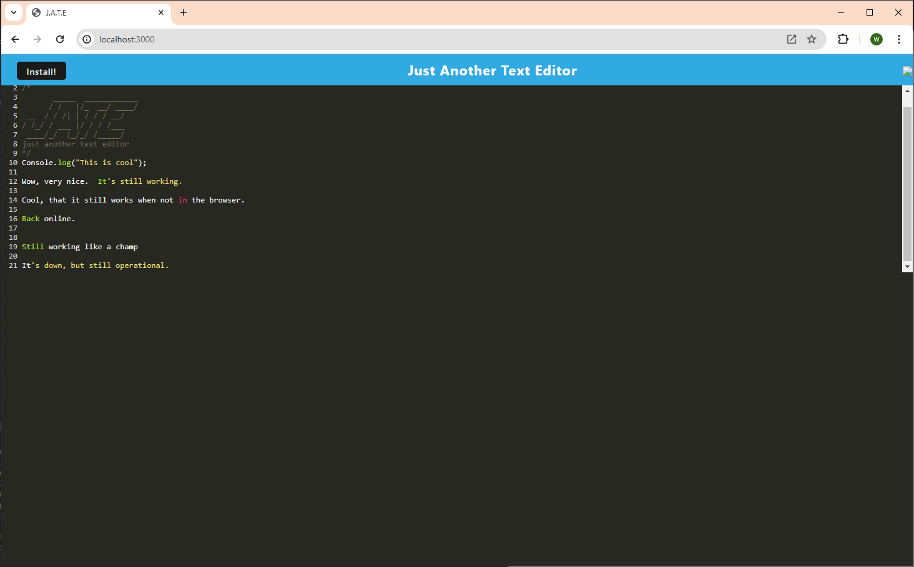
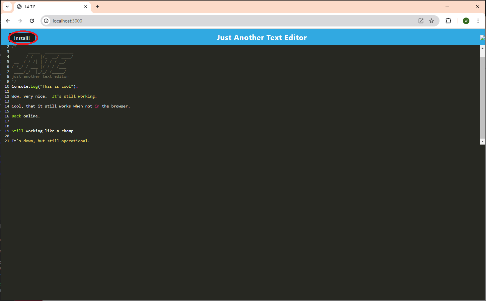
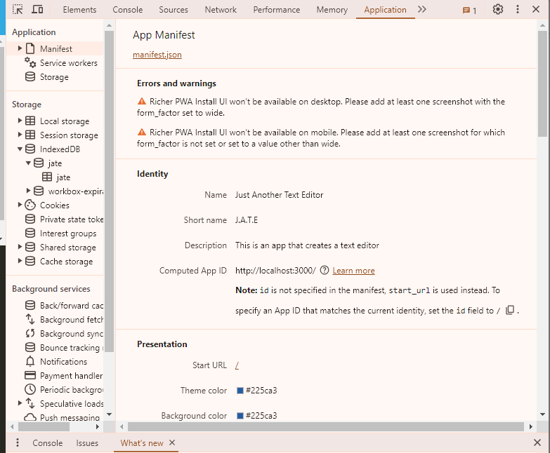
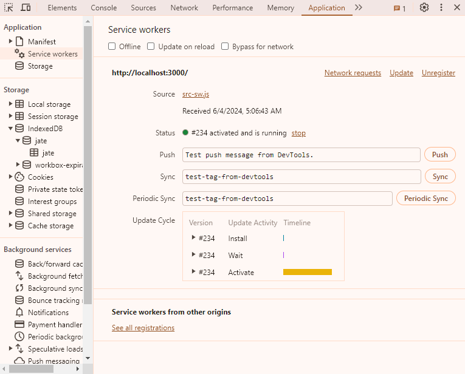
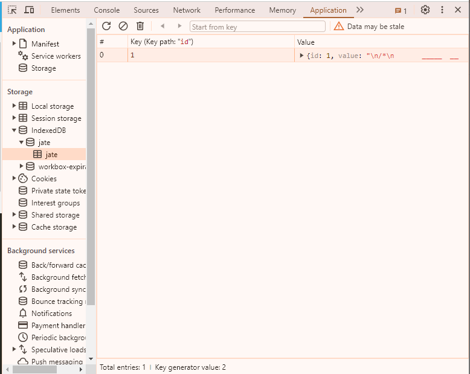

# Unit 19 PWA Homework: Text Editor (Modified Edition)

## Table of Contents
- 
- [Description](#description)
- [Usage](#usage)

## Collaboration
Received the started code and the majority of the code from instructor Gary Almes.

## Description
The text editor application allows for the user to use the app like a text editor.  What is special about it is that the application is a Progressive Web Application (PWA).  In simple terms, it means the application can run while off-line or not connected to the server.

Deployment URL - 

GitHub URL - https://github.com/whougie/pwa-text-editor.git

## Usage
To run in the dev mode, run 'npm run start:dev'.

To run in the prod mode, run 'npm run start'

Once the application is up and running, you can use the text editor by typing within the window.

You can install the applicaiton so that it can run off line by installing it.

When the application is working correctly it will have a manifest:

service worker:

indexedDB
